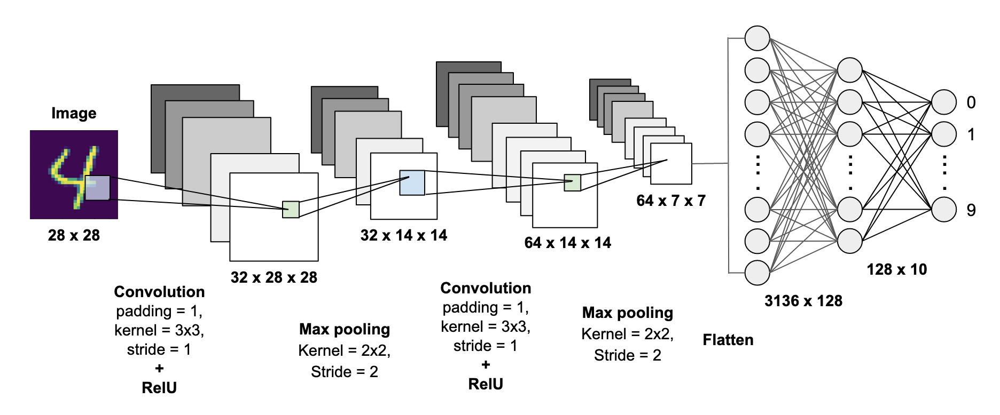

<h1>CNN</h1>
A 'from scratch' implementation of a convolutional neural network library (no pytorch/tensorflow) built only on NumPy and Andrej Karpathy's micrograd differentiation engine:

https://github.com/karpathy/micrograd

micrograd is modified in engine_extension.py to add support for log, sigmoid, pow, rpow, e^x, >=, <= operations.

<h1>Implementation Details</h1>
This project allows users to create convolutional neural networks with an API similar to PyTorch. An example is provided in which a network is used to achieve high accuracy on Mnist. Also included are softmax and negative log likelihood loss functions.

<br>
<br>

The following example creates a ConvNet with 2 convolutional layers, each with 3 5x5 filter kernels, 
taking 1 input channel, and a ReLU activation function.

```
conv = ConvNet(in_channels=1,
                            filters=[3, 3],
                            kernel_sizes=[5, 5],
                            activation='relu')
```


<br>
<br>
To do a forward pass using the network above, simply call it on an input image like this:


```
image: np.ndarray # Get an image formatted as a NumPy ndarray

output = conv(image)

```

<br>

<h1>Files</h1>

test_conv.py: MNist training example

train_eval_conv.py: full model training and evaluation

conv.py: contains Convolutional layer class (Conv2D), Convolutional NNetwork class, and an MNist Classifier. 
Also contains negative-log likelyhood loss and softmax functions

engine_extension.py: extended micrograd Value class
